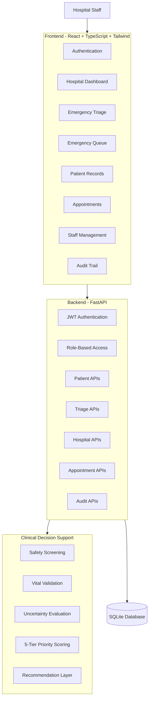

# PatientTriage.ai 🏥

### AI-Assisted Emergency Department Triage & Hospital Care Coordination

> **AI Recommends. Humans Decide.**

PatientTriage.ai is a full-stack clinical decision-support prototype designed to help emergency department staff organize patient intake, identify potential safety concerns, prioritize emergency cases, and manage patient records. The platform combines AI-assisted triage, hospital staff management, emergency queues, patient history, appointments, clinical notes, and audit trails into a unified hospital workflow.

---

## ⚠️ Clinical Disclaimer

> **PatientTriage.ai is an experimental healthcare technology portfolio/research prototype using synthetic patient data.**
>
> It is **NOT a certified medical device** and must NOT be used for real-world diagnosis, treatment, medication decisions, or autonomous healthcare delivery.
>
> All clinical decisions and interventions must be reviewed and performed by qualified healthcare professionals.

---

# 1. Why PatientTriage.ai?

Emergency departments can become overloaded when many patients arrive at the same time. During these situations, healthcare staff need to quickly understand which patients may require immediate attention, which patients can wait, what critical information is missing, and how the current emergency queue should be organized.

PatientTriage.ai explores how AI-assisted software can support this workflow while keeping healthcare professionals in control. The system focuses on structured information, safety checks, patient prioritization, transparent recommendations, and complete hospital workflow management rather than replacing clinical judgment.

The core principle is:

> **AI Recommends. Humans Decide.**

---

# 2. What Does PatientTriage.ai Do?

PatientTriage.ai provides a complete hospital workflow for managing patients from registration through emergency triage and follow-up care. Hospital administrators can create and manage their organization, staff members can access the system according to their roles, and new patients receive automatically generated hospital-specific IDs. When a patient arrives at the emergency department, staff can record symptoms, functional status, vital signs, medical history, and immediate safety information. The system then generates an AI-assisted triage recommendation using deterministic clinical decision-support logic. Patients can be placed into a priority-based emergency queue, where higher-acuity cases are shown first and earlier arrival times are used to order patients with the same priority. Staff can also access longitudinal patient profiles containing previous visits, medical conditions, allergies, medications, doctors, clinical notes, triage history, and upcoming appointments. The platform also supports appointments, encounters, staff management, human clinical overrides, audit trails, and operational analytics.

---

# 3. Main Features

- 🏥 Multi-hospital organization management
- 🔐 Staff authentication and role-based access
- 👤 Automatic patient registration and patient IDs
- 🚑 Emergency department intake
- 🛡️ Immediate safety screening
- ❤️ Vital-sign validation
- 🤖 AI-assisted triage recommendations
- 🚨 Five-level emergency priority system
- 📋 Live emergency acuity queue
- 🗂️ Longitudinal patient records
- 📅 Appointment management
- 🩺 Clinical notes and encounters
- 👨‍⚕️ Doctor and staff management
- ✏️ Human clinical overrides
- 📝 Hospital-scoped audit trails
- 📊 Operational analytics and surge simulation

---

# 4. Project Structure

```text
patient-triage-ai/
│
├── backend/
│   ├── app/
│   │   ├── main.py
│   │   ├── config.py
│   │   ├── database.py
│   │   │
│   │   ├── routes/
│   │   │   ├── auth.py
│   │   │   ├── patients.py
│   │   │   ├── triage.py
│   │   │   ├── appointments.py
│   │   │   ├── hospital.py
│   │   │   └── audit.py
│   │   │
│   │   └── triage_engine/
│   │       ├── safety.py
│   │       ├── scoring.py
│   │       ├── validation.py
│   │       └── explanation.py
│   │
│   ├── tests/
│   │   ├── test_auth.py
│   │   ├── test_api.py
│   │   ├── test_patient_lifecycle.py
│   │   ├── test_patient_id_sequence.py
│   │   ├── test_safety_engine.py
│   │   ├── test_worst_case.py
│   │   ├── test_triage_engine.py
│   │   ├── test_dates_and_validation.py
│   │   ├── test_master_flow.py
│   │   └── test_production_readiness_audit.py
│   │
│   ├── requirements.txt
│   └── Dockerfile
│
├── frontend/
│   ├── src/
│   │   ├── components/
│   │   ├── pages/
│   │   ├── services/
│   │   ├── contexts/
│   │   └── App.tsx
│   │
│   ├── package.json
│   └── Dockerfile
│
├── docker-compose.yml
├── Dockerfile
├── .dockerignore
├── .gitignore
├── start.bat
├── start.sh
└── README.md
````

---

# 5. System Architecture



The frontend provides the hospital workstation interface and communicates with the FastAPI backend through REST APIs. The backend manages authentication, authorization, patient records, appointments, hospital operations, triage requests, and audit information. Clinical decision-support requests are processed by the triage engine, while application data is stored in the SQLite database.

---

# 6. Emergency Triage Workflow

The main emergency workflow is:

```text
Patient Arrives
      ↓
Patient Registration
      ↓
Emergency Intake
      ↓
Symptoms & Functional Assessment
      ↓
Safety Screening
      ↓
Vital Signs & Medical History
      ↓
Triage Assessment
      ↓
Clinical Review
      ↓
Emergency Queue
      ↓
Doctor Consultation
      ↓
Clinical Notes / Encounter
      ↓
Follow-up Appointment
```

The system is designed to assist staff throughout the workflow while keeping the final clinical decision with qualified healthcare professionals.

---

# 7. Five-Level Triage Priority

The prototype uses five priority levels:

| Priority  | Meaning                   |
| --------- | ------------------------- |
| 🔴 RED    | Immediate / Resuscitation |
| 🟠 ORANGE | Very Urgent               |
| 🟡 YELLOW | Urgent                    |
| 🟢 GREEN  | Less Urgent               |
| 🔵 BLUE   | Routine / Non-Emergency   |

The recommendation considers structured information such as:

* Safety findings
* Vital signs
* Symptoms
* Pain/distress
* Consciousness
* Functional status
* Trauma
* Missing critical information
* Physiological plausibility

The result is a **decision-support recommendation, not a diagnosis**.

---

# 8. Emergency Acuity Queue

After triage, patients can enter the emergency queue.

The queue is ordered primarily by clinical priority and then by arrival time.

Example:

```text
1. RED      — 09:42
2. RED      — 09:47
3. ORANGE   — 09:35
4. YELLOW   — 09:20
5. GREEN    — 09:10
```

Patient workflow states include:

```text
WAITING
    ↓
IN_CONSULTATION
    ↓
COMPLETED
```

This gives emergency department staff an operational view of patients currently waiting for attention.

---

# 9. Patient Records

PatientTriage.ai maintains a longitudinal patient profile rather than treating every visit as a separate record.

A patient profile can contain:

* Patient demographics
* Previous visits
* Emergency encounters
* Medical history
* Chronic conditions
* Allergies
* Medications
* Clinical notes
* Current and previous doctors
* Triage history
* Upcoming appointments
* Visit status

Patient IDs are automatically generated by the server.

Example:

```text
AP-2026-000001
AP-2026-000002
AP-2026-000003
```

The format is:

```text
{HOSPITAL_CODE}-{YEAR}-{SEQUENCE}
```

The sequence is maintained separately for each hospital.

---

# 10. Multi-Hospital Architecture

PatientTriage.ai is designed as a multi-hospital platform.

Each hospital operates inside its own organization boundary.

```text
                 PatientTriage.ai
                        │
        ┌───────────────┼───────────────┐
        │               │               │
   Hospital A      Hospital B      Hospital C
        │               │               │
    Patients        Patients        Patients
    Staff           Staff           Staff
    Visits          Visits          Visits
    Triage          Triage          Triage
```

Supported staff roles include:

* Hospital Admin
* Doctor
* Triage Nurse
* Receptionist

---

# 11. Technology Stack

### Frontend

* React 18
* TypeScript
* Vite
* Tailwind CSS
* Lucide React

### Backend

* Python
* FastAPI
* Pydantic
* JWT Authentication
* Password Hashing

### AI / Decision Support

* Deterministic Python-based triage engine
* Safety and uncertainty evaluation
* Priority scoring
* Recommendation layer
* Optional OpenAI / Gemini integration

### Database

* SQLite
* Hospital-scoped patient records
* Medical histories
* Visits and appointments
* Triage records
* Audit logs
* Patient ID sequences

### Testing

* Pytest
* API testing
* Triage engine testing
* Patient lifecycle testing
* End-to-end workflow testing

### Deployment

* Docker
* Docker Compose
* Nginx
* Render-compatible deployment

---

# 12. Installation & Running Locally

## Prerequisites

Install:

* Python 3.10+
* Node.js 18+
* npm
* Git

---

## Clone the Repository

```bash
git clone https://github.com/molathotisaiteja1267-ctrl/patient-triage-ai.git
cd patient-triage-ai
```

---

## Backend Setup

```bash
cd backend
python -m venv venv
```

### Windows

```powershell
venv\Scripts\activate
```

### Linux / macOS

```bash
source venv/bin/activate
```

Install dependencies:

```bash
pip install -r requirements.txt
```

Start the backend:

```bash
uvicorn app.main:app --reload --port 8000
```

Backend:

```text
http://localhost:8000
```

Swagger API documentation:

```text
http://localhost:8000/docs
```

Health check:

```text
http://localhost:8000/health
```

---

## Frontend Setup

Open another terminal:

```bash
cd frontend
npm install
npm run dev
```

Frontend:

```text
http://localhost:5173
```

---

# 13. Docker Deployment

Docker provides an easy way to run the complete application.

### Prerequisites

Install:

* Docker Desktop
* Docker Compose

From the project root:

```bash
docker compose up --build
```

The application runs as:

```text
Frontend → Nginx → FastAPI → SQLite
```

Open the application:

```text
http://localhost:5173
```

Backend:

```text
http://localhost:8000
```

Swagger:

```text
http://localhost:8000/docs
```

Health check:

```text
http://localhost:8000/health
```

### Run in Background

```bash
docker compose up -d --build
```

Check containers:

```bash
docker compose ps
```

View logs:

```bash
docker compose logs
```

Stop:

```bash
docker compose down
```

---

# 14. Automated Test Suite

PatientTriage.ai includes automated backend tests covering authentication, hospital isolation, patient management, safety checks, triage logic, appointments, and complete workflows.

Run all tests:

```bash
pytest backend/tests -v
```

Or from the backend directory:

```bash
pytest tests -v
```

### Test Areas

* `test_auth.py` — Authentication and staff permissions
* `test_api.py` — API endpoints and health checks
* `test_patient_lifecycle.py` — Patient records and encounters
* `test_patient_id_sequence.py` — Hospital-specific sequential patient IDs
* `test_safety_engine.py` — Safety screening
* `test_worst_case.py` — Missing data and abnormal values
* `test_triage_engine.py` — Deterministic priority scoring
* `test_dates_and_validation.py` — Date and datetime validation
* `test_master_flow.py` — Complete multi-hospital workflow
* `test_production_readiness_audit.py` — Production workflow audit

The test suite is designed to verify both individual components and complete end-to-end hospital workflows.

---

# 15. Environment Variables

Create a `.env` file when required.

Example:

```env
ENVIRONMENT=development
DATABASE_PATH=patient_triage.db

OPENAI_API_KEY=
GEMINI_API_KEY=

VITE_API_URL=http://localhost:8000/api
```

The core triage engine can operate without an external LLM API.

Optional OpenAI or Gemini integration can be used to enhance explanations.

**Never commit API keys or other secrets to GitHub.**

---

# 16. Important Limitations

PatientTriage.ai is a software prototype and has not been clinically validated.

It does not:

* Diagnose patients
* Prescribe medication
* Automatically treat patients
* Replace doctors or nurses
* Make autonomous healthcare decisions

The current prototype uses SQLite for simplicity and demonstration. A real production healthcare system would require production-grade database infrastructure, clinical validation, regulatory compliance, monitoring, security controls, interoperability, and extensive testing.

All patient scenarios used with this project should be synthetic.

---

# 17. Future Improvements

Potential future improvements include:

* PostgreSQL production database
* Hospital bed management
* Doctor workload management
* Department routing
* Waiting-time prediction
* Hospital capacity forecasting
* Advanced operational analytics
* Healthcare interoperability
* Improved clinical explainability
* Model evaluation and monitoring
* Enterprise authentication
* Advanced security monitoring

---

# 18. License

This project is licensed under the MIT License.

See the [LICENSE](LICENSE) file for details.

---

## PatientTriage.ai

**AI-Assisted Emergency Department Triage & Hospital Care Coordination**

> **AI Recommends. Humans Decide.**

Built as a healthcare technology research and portfolio prototype focused on AI-assisted decision support, emergency workflow management, and responsible human-in-the-loop AI.

```
```
