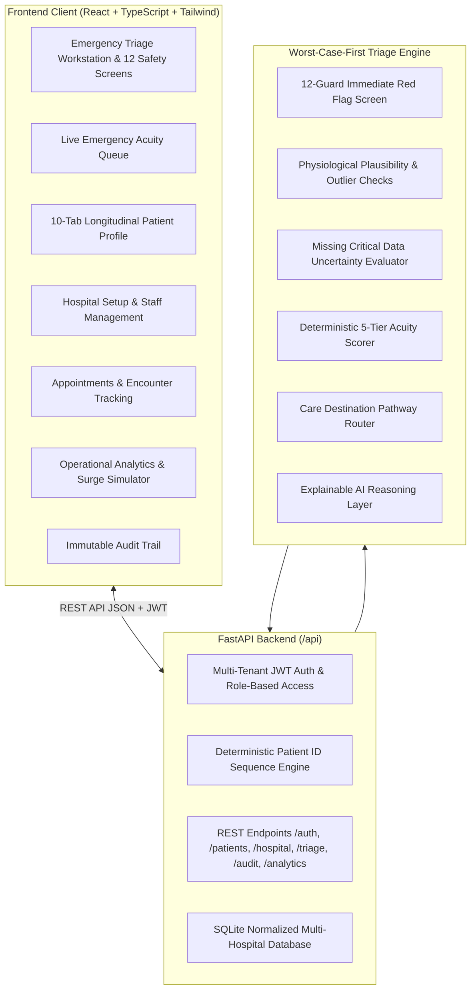

# PatientTriage.ai 🏥
### AI-Assisted Emergency Department Triage Decision Support Prototype

[](https://opensource.org/licenses/MIT)
[](https://fastapi.tiangolo.com)
[](https://reactjs.org/)
[](https://www.typescriptlang.org/)
[](https://tailwindcss.com/)
[]()

> **CORE PRINCIPLE: "AI Recommends. Humans Decide."**
> 
> PatientTriage.ai is an intelligent, multi-hospital clinical decision-support and patient care coordination platform designed for emergency departments, triage nurses, and physicians.

---

## ⚠️ Important Clinical Disclaimer

> [!WARNING]
> **PatientTriage.ai is an experimental healthcare technology portfolio prototype utilizing 100% synthetic patient scenarios.**
> It is **NOT** a certified medical device and must **NEVER** be used for real-world patient diagnosis, pharmacological prescription, or autonomous healthcare delivery.
> All patient triage, care pathways, and clinical interventions must be confirmed and executed by licensed healthcare professionals.

---

## 1. Overview & Key Capabilities

PatientTriage.ai connects hospital emergency departments and longitudinal outpatient tracking in a single, robust platform:
* **Multi-Hospital Isolation:** Strict organization-level tenant boundaries. Hospital A staff never see Hospital B patients, appointments, triage records, or audit logs.
* **Deterministic Patient IDs:** Automatic server-side sequential IDs formatted as `{HOSPITAL_CODE}-YYYY-{SEQUENCE:06d}` (e.g. `AP-2026-000001`).
* **Worst-Case-First Clinical Safety Screen:** 12 immediate red-flag guards with explicit `YES / NO / UNKNOWN` distinction (`UNKNOWN` escalates uncertainty, never treated as normal).
* **5-Tier Clinical Triage Priority:** RED (Resuscitation), ORANGE (Very Urgent), YELLOW (Urgent), GREEN (Less Urgent), BLUE (Non-Emergency) with transparent factor breakdowns.
* **Dynamic Emergency Acuity Queue:** Live priority ordering by clinical urgency and arrival time with real-time status transitions (`WAITING` → `IN_CONSULTATION` → `COMPLETED`).
* **Longitudinal Patient Record:** Unified 10-tab patient profile including encounters, past medical history, chronic conditions, verified allergies, scheduled appointments, triage timeline, and clinical notes.
* **Human-in-the-Loop Governance:** Mandatory clinical override justification with immutable, hospital-scoped audit trails.
* **Light Clinical EHR Aesthetic:** Professional hospital workstation styling adhering to high contrast, clear information hierarchy, and zero invasive browser popups.

---

## 2. System Architecture



---

## 3. Installation & Running Locally

### Option A: One-Click Startup (Windows / Linux)
```bash
# Windows:
start.bat

# Linux / macOS:
chmod +x start.sh && ./start.sh
```

### Option B: Manual Setup

#### 1. Backend Setup
```bash
cd backend
python -m venv venv
# Activate venv:
# Windows: venv\Scripts\activate
# Linux/macOS: source venv/bin/activate
pip install -r requirements.txt

# Run complete automated test suite
pytest -v

# Start FastAPI server
uvicorn app.main:app --reload --port 8000
```
Backend API will be accessible at `http://localhost:8000` (Swagger Docs: `http://localhost:8000/docs`, Health: `http://localhost:8000/health`).

#### 2. Frontend Setup
```bash
cd frontend
npm install
npm run dev
```
Frontend EHR Workstation will be accessible at `http://localhost:5173`.

---

## 4. Docker Deployment

Launch the complete full-stack environment with Docker Compose:
```bash
docker-compose up --build
```
Access the application at `http://localhost:5173`.

---

## 5. Automated Test Suite

The backend includes **24 automated test cases** covering multi-hospital tenant isolation, sequential ID generation, worst-case safety handling, physiological boundaries, appointment tracking, and clinical workflows:

```bash
pytest backend/tests -v
```

### Verified Test Suites:
* `test_production_readiness_audit.py`: Comprehensive 39-phase end-to-end audit test across multi-hospital lifecycle.
* `test_master_flow.py`: Full 28-step clinical journey across two isolated hospital organizations.
* `test_dates_and_validation.py`: Pydantic V2 date/datetime validation & clean serialization.
* `test_patient_id_sequence.py`: Atomic, thread-safe, hospital-scoped sequential ID generation.
* `test_safety_engine.py`: 12 safety screening guards and `UNKNOWN != NO` uncertainty evaluation.
* `test_worst_case.py`: Missing vitals escalation, physiological range checks, and hemodynamic fail-safes.
* `test_triage_engine.py`: Deterministic 5-tier priority scoring and clinical routing.
* `test_auth.py`: Multi-hospital registration, staff invitations, and role-based permissions.
* `test_patient_lifecycle.py`: Longitudinal profiles, visits, clinical notes, and appointment lifecycle.
* `test_api.py`: Endpoint availability, health checks, and error responses.

---

## 9. Resume & Portfolio Bullet Points

* **AI-Assisted Emergency Decision Support:** Engineered a full-stack clinical triage decision-support prototype (Python, FastAPI, React, TypeScript) enabling emergency nurses to prioritize acute patients during hospital surges.
* **Worst-Case-First Safety Engine:** Architected a defensive clinical safety engine that prevents dangerous algorithmic false reassurance by elevating acuity when critical vital signs are missing and detecting physiological outliers.
* **Human-in-the-Loop Governance:** Implemented mandatory clinician override tracking and an immutable SQLite audit log recording clinical rationales, staff IDs, and parameter snapshots for 100% transparency.
* **Emergency Department Surge Simulator:** Built an interactive operational load simulator (Normal, Moderate, High, Critical Overload) demonstrating dynamic queue sequencing and wait-time escalation.
* **100% Deterministic + LLM Fallback:** Designed a robust dual-layer explanation engine providing transparent, auditable clinical reasoning with or without external cloud LLM connectivity.

---

## 10. License

MIT License — see [LICENSE](LICENSE) for details.
