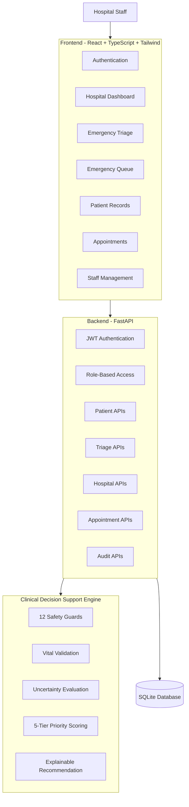

# PatientTriage.ai 🏥

### AI-Assisted Emergency Department Triage & Hospital Care Coordination

> **AI Recommends. Humans Decide.**

PatientTriage.ai is a full-stack clinical decision-support prototype designed to help emergency department staff organize patient intake, identify safety concerns, prioritize emergency cases, and manage patient records.

The platform combines a **safety-first deterministic triage engine**, hospital staff management, patient records, emergency queues, appointments, clinical notes, and audit trails into a single hospital workflow.

---

## ⚠️ Clinical Disclaimer

> **PatientTriage.ai is an experimental healthcare technology portfolio/research prototype using synthetic patient data.**
>
> It is **NOT a certified medical device** and must NOT be used for real-world diagnosis, treatment, medication decisions, or autonomous healthcare delivery.
>
> All clinical decisions and interventions must be reviewed and performed by qualified healthcare professionals.

---

# 1. Why PatientTriage.ai?

Emergency departments can become overloaded when many patients arrive at the same time. During these situations, staff need to quickly identify which patients require immediate attention, which patients can safely wait, and whether important information is missing.

PatientTriage.ai explores how AI-assisted software can support this workflow without replacing healthcare professionals.

The system is designed around three principles:

- **AI recommends — humans decide**
- **Worst-case safety before average-case optimization**
- **Transparent and auditable recommendations**

Instead of simply producing an AI-generated priority, the platform checks safety conditions, validates available information, identifies uncertainty, and provides an explainable recommendation for clinical review.

---

# 2. What Does PatientTriage.ai Do?

The platform provides the following major capabilities:

- 🏥 Multi-hospital organization management
- 🔐 Staff authentication and role-based access
- 👤 Automatic patient registration and patient IDs
- 🚑 Emergency department intake
- 🛡️ 12 immediate safety guards
- ❤️ Vital-sign validation
- 🤖 Deterministic AI-assisted triage recommendation
- 🚨 Five-level emergency priority system
- 📋 Live emergency acuity queue
- 🗂️ Longitudinal patient records
- 📅 Appointment management
- 🩺 Clinical notes and encounters
- 👨‍⚕️ Doctor and staff management
- ✏️ Human clinical overrides
- 📝 Hospital-scoped audit trails
- 📊 Operational analytics and surge simulation

---

# 3. Emergency Triage Workflow

The main workflow is:

```text
Patient Arrives
      ↓
Patient Registration
      ↓
Emergency Intake
      ↓
Symptoms & Functional Assessment
      ↓
Safety Screening
      ↓
Vital Signs & Medical History
      ↓
Uncertainty & Safety Evaluation
      ↓
Triage Recommendation
      ↓
Clinical Review
      ↓
Emergency Queue
      ↓
Doctor Consultation
      ↓
Clinical Notes / Encounter
      ↓
Follow-up Appointment
````

The system assists staff throughout this process while keeping the final decision with healthcare professionals.

---

# 4. Safety-First Triage Engine

PatientTriage.ai uses a **worst-case-first safety approach**.

The system currently checks 12 immediate safety categories:

1. Airway compromise
2. Severe breathing difficulty
3. Shock / poor perfusion
4. Chest pain
5. Loss of consciousness
6. Altered mental status
7. Seizure
8. Stroke-like symptoms
9. Severe bleeding / hemorrhage
10. Anaphylaxis
11. Major trauma
12. Severe pain / distress

Each safety condition supports:

```text
YES
NO
UNKNOWN
```

A key design principle is:

```text
UNKNOWN ≠ NO
```

If critical information is missing, the system does not automatically assume that the patient is safe. Instead, uncertainty can increase the need for human review.

---

# 5. Five-Level Triage Priority

The prototype uses five priority levels:

| Priority  | Meaning                   |
| --------- | ------------------------- |
| 🔴 RED    | Immediate / Resuscitation |
| 🟠 ORANGE | Very Urgent               |
| 🟡 YELLOW | Urgent                    |
| 🟢 GREEN  | Less Urgent               |
| 🔵 BLUE   | Routine / Non-Emergency   |

The recommendation considers structured information such as:

* Safety findings
* Vital signs
* Symptoms
* Pain/distress
* Consciousness
* Functional status
* Trauma
* Missing critical information
* Physiological plausibility

The result is a **decision-support recommendation, not a diagnosis**.

---

# 6. Explainable Recommendations

PatientTriage.ai does not aim to return only a priority label such as:

```text
RED
```

Instead, the system provides supporting factors that explain why a recommendation was generated.

Example:

```text
Recommended Priority: RED

Contributing Factors:
- Immediate safety concern detected
- Abnormal vital sign identified
- Critical information is missing

Human Review Required
```

This allows healthcare professionals to review the recommendation instead of blindly accepting an unexplained AI output.

---

# 7. Emergency Acuity Queue

After triage, patients can enter the emergency queue.

The queue is ordered primarily by clinical priority and then by arrival time.

Example:

```text
1. RED      — 09:42
2. RED      — 09:47
3. ORANGE   — 09:35
4. YELLOW   — 09:20
5. GREEN    — 09:10
```

Patient workflow states include:

```text
WAITING
    ↓
IN_CONSULTATION
    ↓
COMPLETED
```

This provides staff with a real-time operational view of patients waiting for attention.

---

# 8. Patient Records

PatientTriage.ai maintains a longitudinal patient profile instead of treating every visit as a separate record.

A patient profile can contain:

* Patient demographics
* Previous visits
* Emergency encounters
* Medical history
* Chronic conditions
* Allergies
* Medications
* Clinical notes
* Current and previous doctors
* Triage history
* Upcoming appointments
* Visit status

Patient IDs are automatically generated by the server.

Example:

```text
AP-2026-000001
AP-2026-000002
AP-2026-000003
```

The format is:

```text
{HOSPITAL_CODE}-{YEAR}-{SEQUENCE}
```

The sequence is maintained separately for each hospital.

---

# 9. Multi-Hospital Architecture

PatientTriage.ai is designed as a multi-hospital platform.

Each hospital operates inside its own organization boundary.

```text
                 PatientTriage.ai
                        │
        ┌───────────────┼───────────────┐
        │               │               │
   Hospital A      Hospital B      Hospital C
        │               │               │
    Patients        Patients        Patients
    Staff           Staff           Staff
    Visits          Visits          Visits
    Triage          Triage          Triage
```

Hospital staff should only be able to access data belonging to their own organization.

Supported staff roles include:

* Hospital Admin
* Doctor
* Triage Nurse
* Receptionist

---

# 10. System Architecture



---

# 11. Technology Stack

### Frontend

* React 18
* TypeScript
* Vite
* Tailwind CSS
* Lucide React

### Backend

* Python
* FastAPI
* Pydantic
* JWT Authentication
* Password Hashing

### AI / Decision Support

* Deterministic Python-based triage engine
* Safety and uncertainty evaluation
* Explainable recommendation layer
* Optional OpenAI / Gemini integration

### Database

* SQLite
* Hospital-scoped patient and workflow records
* Audit logs
* Patient ID sequences

### Testing

* Pytest
* API testing
* Clinical engine testing
* End-to-end workflow testing

### Deployment

* Docker
* Docker Compose
* Nginx
* Render-compatible container deployment

---

# 12. Project Structure

```text
patient-triage-ai/
│
├── backend/
│   ├── app/
│   │   ├── main.py
│   │   ├── config.py
│   │   ├── database.py
│   │   ├── routes/
│   │   └── triage_engine/
│   │
│   ├── tests/
│   ├── requirements.txt
│   └── Dockerfile
│
├── frontend/
│   ├── src/
│   │   ├── components/
│   │   ├── pages/
│   │   ├── services/
│   │   └── contexts/
│   ├── package.json
│   └── Dockerfile
│
├── docker-compose.yml
├── Dockerfile
├── .dockerignore
├── .gitignore
├── start.bat
├── start.sh
└── README.md
```

---

# 13. Installation & Running Locally

## Prerequisites

Install:

* Python 3.10+
* Node.js 18+
* npm
* Git

---

## Clone the Repository

```bash
git clone https://github.com/molathotisaiteja1267-ctrl/patient-triage-ai.git
cd patient-triage-ai
```

---

## Backend Setup

```bash
cd backend
python -m venv venv
```

### Windows

```powershell
venv\Scripts\activate
```

### Linux / macOS

```bash
source venv/bin/activate
```

Install dependencies:

```bash
pip install -r requirements.txt
```

Run the backend:

```bash
uvicorn app.main:app --reload --port 8000
```

Backend:

```text
http://localhost:8000
```

Swagger API documentation:

```text
http://localhost:8000/docs
```

Health check:

```text
http://localhost:8000/health
```

---

## Frontend Setup

Open a second terminal:

```bash
cd frontend
npm install
npm run dev
```

Frontend:

```text
http://localhost:5173
```

---

# 14. Docker Deployment

Docker provides an easier way to run the complete application.

### Prerequisites

Install:

* Docker Desktop
* Docker Compose

From the project root:

```bash
docker compose up --build
```

The application will start with:

```text
Frontend → Nginx → FastAPI → SQLite
```

Open:

```text
http://localhost:5173
```

Backend:

```text
http://localhost:8000
```

Swagger:

```text
http://localhost:8000/docs
```

Health:

```text
http://localhost:8000/health
```

### Run in Background

```bash
docker compose up -d --build
```

Check containers:

```bash
docker compose ps
```

View logs:

```bash
docker compose logs
```

Stop:

```bash
docker compose down
```

---

# 15. Automated Test Suite

PatientTriage.ai includes automated backend tests covering authentication, hospital isolation, patient management, safety checks, triage logic, appointments, and complete workflows.

Run all tests:

```bash
pytest backend/tests -v
```

Or from the backend directory:

```bash
pytest tests -v
```

Important test areas include:

* `test_auth.py` — Authentication and staff permissions
* `test_api.py` — API endpoints and health checks
* `test_patient_lifecycle.py` — Patient records and encounters
* `test_patient_id_sequence.py` — Sequential hospital-specific patient IDs
* `test_safety_engine.py` — 12 safety guards
* `test_worst_case.py` — Missing data and abnormal values
* `test_triage_engine.py` — Deterministic priority scoring
* `test_dates_and_validation.py` — Date and datetime validation
* `test_master_flow.py` — Complete multi-hospital workflow
* `test_production_readiness_audit.py` — Production workflow audit

The test suite is intended to verify both individual components and complete end-to-end hospital workflows.

---

# 16. Environment Variables

Create a `.env` file when required.

Example:

```env
ENVIRONMENT=development
DATABASE_PATH=patient_triage.db

OPENAI_API_KEY=
GEMINI_API_KEY=

VITE_API_URL=http://localhost:8000/api
```

The core triage engine does not require an external LLM API.

If an API key is provided, an LLM can optionally be used to enhance explanations.

**Never commit API keys or other secrets to GitHub.**

---

# 17. Security & Privacy

The prototype includes:

* JWT-based authentication
* Password hashing
* Role-based access control
* Hospital-level data isolation
* Server-side patient ID generation
* Audit logging
* Backend validation
* Environment-based secret configuration

All project patient scenarios should use **synthetic data only**.

Do not upload real patient information to this repository or public deployment.

---

# 18. Important Limitations

PatientTriage.ai is a software prototype and has not been clinically validated.

It does not:

* Diagnose patients
* Prescribe medication
* Automatically treat patients
* Replace doctors or nurses
* Make autonomous healthcare decisions

The current project uses SQLite for simplicity and demonstration. For a real production healthcare system, a production-grade database, stronger infrastructure security, clinical validation, regulatory compliance, monitoring, interoperability, and extensive testing would be required.

---

# 19. Future Improvements

Potential future improvements include:

* PostgreSQL production database
* Hospital bed management
* Doctor workload management
* Department routing
* Waiting-time prediction
* Hospital capacity forecasting
* Advanced analytics
* Healthcare interoperability
* More detailed clinical explainability
* Model evaluation and monitoring
* Enterprise authentication
* Advanced security and monitoring

---

# 20. License

This project is licensed under the MIT License.

See the [LICENSE](LICENSE) file for details.

---

## PatientTriage.ai

**AI-Assisted Emergency Department Triage & Hospital Care Coordination**

> **AI Recommends. Humans Decide.**

Built as a healthcare technology research and portfolio prototype focused on AI-assisted decision support, emergency workflow management, and responsible human-in-the-loop AI.

```
```
